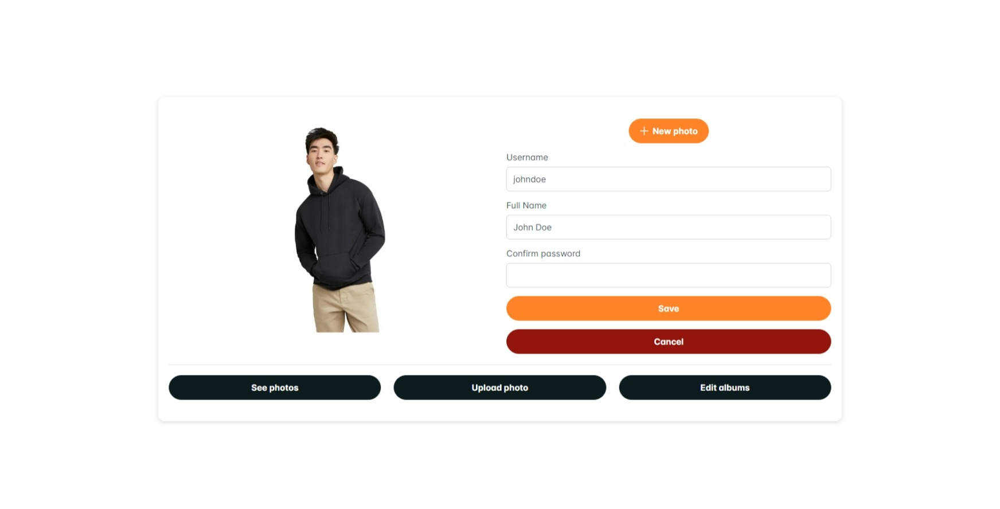
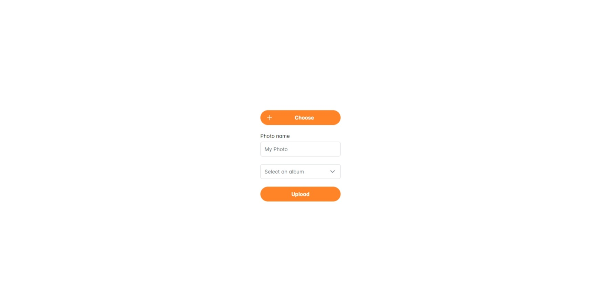
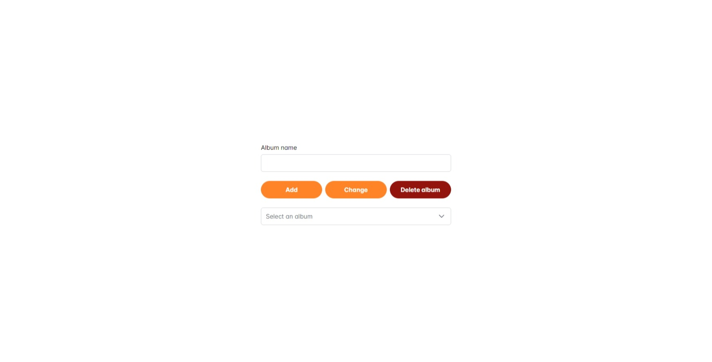
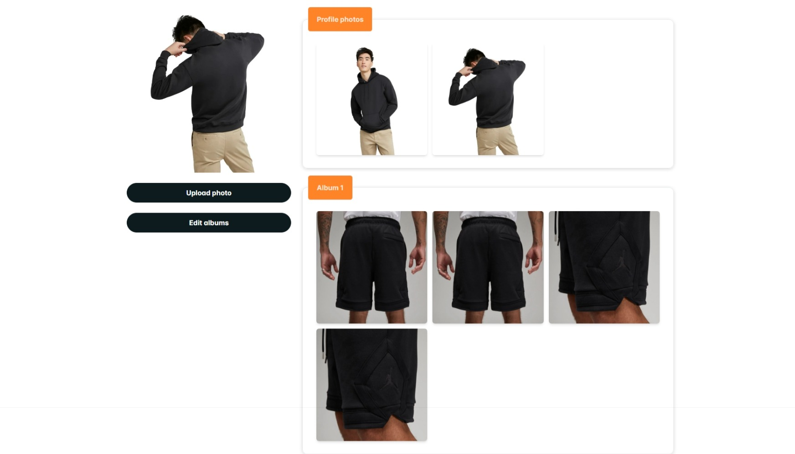

# AWS Albums app
This is a web app that uses a S3 bucket from AWS to store photos. The backend was deployed in a EC2 computing machine and the frontend is stored in the same S3 bucket.
I was created using the following technologies:
* NestJS (Node)
* Postgres
* ReactJS
* Tailwind CSS
* Prime React
This repository also has workflow to auto deploy the app via github actions.

## Home

## Upload

## Edit

## Albums

